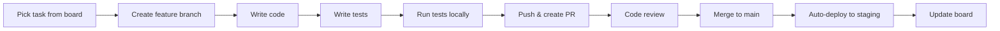

# 🚀 Getting Started with Nexus-Alpha

**Welcome to Nexus-Alpha!** 이 가이드는 프로젝트에 처음 참여하는 개발자를 위한 빠른 시작 가이드입니다.

---

## 📖 5분 안에 이해하기

### What is Nexus-Alpha?
금융 시뮬레이션 플랫폼 - 금리, 유동성, 소셜 신호 등을 기반으로 **"만약 ~라면?"** 시나리오를 시뮬레이션

### How does it work?
```
User adjusts slider (금리 3.5% → 4.5%)
    ↓
Frontend sends request to SimViz Service
    ↓
SimViz calls Quant Engine (Python calculations)
    ↓
Quant Engine returns impact analysis
    ↓
SimViz generates 3D network graph
    ↓
Frontend displays interactive visualization
```

### Current Focus
**부동산 섹터** - 금리 변동이 부동산 기업 재무에 미치는 영향 시뮬레이션

---

## 🗺️ Navigation Guide

### 🎯 프로젝트 전체 이해하기
1. **Start here:** [README.md](./README.md) - 프로젝트 개요 및 빠른 네비게이션
2. **Architecture:** [ARCHITECTURE.md](./docs/ARCHITECTURE.md) - 시스템 구조 이해
3. **Team Structure:** [TEAM_STRUCTURE.md](./docs/teams/TEAM_STRUCTURE.md) - 누가 무엇을 하는지

### 📊 현재 무엇을 개발 중인지 확인하기
1. **Development Board:** [DEVELOPMENT_BOARD.md](./DEVELOPMENT_BOARD.md) - 작업 현황 대시보드
2. **Current Sprint:** Week 1 - Real Estate Backend (진행률 25%)

### 🔄 새로운 기능 추가 방법
1. **Process Guide:** [DEVELOPMENT_PROCESS.md](./DEVELOPMENT_PROCESS.md) - 단계별 프로세스
2. **Templates:** 섹터 추가 시 따라할 템플릿 제공

### 👥 팀별 가이드
| 팀 | 핸드북 | 워크스페이스 README |
|---|--------|---------------------|
| UI (Frontend) | [Handbook](./docs/teams/TEAM_UI_HANDBOOK.md) | [README](./apps/web/README.md) |
| Platform (Backend) | [Handbook](./docs/teams/TEAM_PLATFORM_HANDBOOK.md) | [README](./apps/api-gateway/README.md) |
| Quant (ML/AI) | [Handbook](./docs/teams/TEAM_QUANT_HANDBOOK.md) | [README](./services/quant-engine/README.md) |
| Data (ETL) | [Handbook](./docs/teams/TEAM_DATA_HANDBOOK.md) | [README](./services/data-pipeline/README.md) |
| SimViz (Viz) | [Handbook](./docs/teams/TEAM_SIMVIZ_HANDBOOK.md) | [README](./services/simviz-service/README.md) |
| Infra (DevOps) | [Handbook](./docs/teams/TEAM_INFRA_HANDBOOK.md) | [README](./infra/README.md) |

---

## 💻 Setup Your Dev Environment

### 1. Clone Repository
```bash
git clone https://github.com/nexus-alpha/nexus-alpha.git
cd nexus-alpha
```

### 2. Choose Your Workspace

#### Frontend Developer → `apps/web/`
```bash
cd apps/web
pnpm install
cp .env.example .env.local
# Edit .env.local with API URLs
pnpm dev
# Open http://localhost:3000
```

#### Backend Developer → `services/quant-engine/`
```bash
cd services/quant-engine
python -m venv venv
source venv/bin/activate
pip install -r requirements.txt
cp .env.example .env
# Edit .env with database URL
uvicorn app.main:app --reload --port 8000
# API docs: http://localhost:8000/docs
```

#### Data Engineer → `services/data-pipeline/`
```bash
cd services/data-pipeline
python -m venv venv
source venv/bin/activate
pip install -r requirements.txt
export AIRFLOW_HOME=$(pwd)
airflow db init
airflow webserver --port 8081
# Open http://localhost:8081
```

### 3. Read Your Team's Handbook
각 팀의 Handbook에는 상세한 설정 가이드, 코드 예제, 테스팅 방법이 포함되어 있습니다.

---

## 🏗️ Current Project: Real Estate Pilot

### What are we building?
금리 시뮬레이터 - 사용자가 금리를 조정하면:
1. 부동산 기업들의 이자비용 계산
2. 순이익 변화 분석
3. 재무 건전성 점수 산출
4. 3D 네트워크 그래프로 시각화

### Your Role

#### Week 1 (Current) - Backend Focus
**Team Quant** is building the simulation engine:
- [ ] `RealEstateSimulator` class (금리 영향 계산)
- [ ] Health score algorithm (건전성 점수)
- [ ] FastAPI endpoint (API)

**Your first task:** Check [DEVELOPMENT_BOARD.md](./DEVELOPMENT_BOARD.md#week-1-planning--backend-foundation)

#### Week 2 - Frontend & Visualization
**Team UI** + **Team SimViz** will build:
- [ ] React components (슬라이더, 테이블, 그래프)
- [ ] D3.js network graph
- [ ] API integration

#### Week 3 - Data Integration
**Team Data** will connect real data:
- [ ] DART API crawler (금융감독원 재무제표)
- [ ] PostgreSQL schema
- [ ] Airflow ETL pipeline

#### Week 4 - Testing & Deployment
**All teams** will test and deploy:
- [ ] E2E tests (Playwright)
- [ ] Performance tests (K6)
- [ ] Staging deployment

---

## 🔧 Common Tasks

### Add New Task to Board
1. Open [DEVELOPMENT_BOARD.md](./DEVELOPMENT_BOARD.md)
2. Find your team's section
3. Add row to task table:
```markdown
| New task description | Your Name | 📋 Todo | 0% | Xh | - |
```

### Create New Feature
1. Read [DEVELOPMENT_PROCESS.md](./DEVELOPMENT_PROCESS.md)
2. Create spec: `/docs/implementation/[FEATURE]_SPEC.md`
3. Update board
4. Start coding

### Run Tests
```bash
# Backend (Python)
pytest

# Frontend (TypeScript)
pnpm test

# Integration
pytest tests/integration/
```

### Deploy to Staging
```bash
# Build Docker image
docker build -t nexus-alpha/[service]:[tag] .

# Push to registry
docker push nexus-alpha/[service]:[tag]

# Deploy to Kubernetes
kubectl apply -f infra/kubernetes/applications/[service]/
```

---

## 📚 Essential Reading (First Week)

### Day 1: Project Overview
- [ ] [README.md](./README.md) - 전체 개요
- [ ] [DEVELOPMENT_BOARD.md](./DEVELOPMENT_BOARD.md) - 현재 작업
- [ ] Your team's handbook

### Day 2: Technical Deep Dive
- [ ] [ARCHITECTURE.md](./docs/ARCHITECTURE.md) - 시스템 구조
- [ ] [DEVELOPMENT_PROCESS.md](./DEVELOPMENT_PROCESS.md) - 개발 프로세스
- [ ] Workspace README (your service)

### Day 3-5: Implementation
- [ ] [Real Estate Pilot Guide](./docs/implementation/REAL_ESTATE_PILOT_GUIDE.md)
- [ ] Start your first task from board
- [ ] Join team Slack channel

---

## 🎓 Learning Resources

### For Beginners
- **Next.js:** https://nextjs.org/learn
- **Python FastAPI:** https://fastapi.tiangolo.com/tutorial/
- **D3.js:** https://observablehq.com/@d3/learn-d3
- **Kubernetes:** https://kubernetes.io/docs/tutorials/

### For Advanced
- **Three.js:** https://threejs-journey.com/
- **Financial ML:** "Advances in Financial Machine Learning" - Marcos López de Prado
- **System Design:** https://github.com/donnemartin/system-design-primer

---

## 🆘 Getting Help

### 1. Check Documentation First
- Workspace README
- Team handbook
- Development process guide

### 2. Search Issues
- GitHub Issues tab
- Slack search

### 3. Ask Your Team
| Question Type | Channel |
|---------------|---------|
| Technical help | Team-specific channel (#team-ui, etc.) |
| Process question | #general |
| Urgent blocker | #incidents |
| Code review | PR comment |

### 4. Escalate
- Team Lead → Tech Lead → CTO

---

## 🚦 Development Workflow



### Git Workflow
```bash
# 1. Create branch
git checkout -b feature/real-estate-simulator

# 2. Make changes
# ... write code ...

# 3. Commit (Conventional Commits)
git commit -m "feat(quant): add real estate simulator"

# 4. Push
git push origin feature/real-estate-simulator

# 5. Create PR on GitHub
# 6. Wait for review (24h)
# 7. Merge after approval
```

---

## ✅ First Week Checklist

### Setup
- [ ] Repository cloned
- [ ] Dev environment running
- [ ] Tests passing locally
- [ ] Slack account created
- [ ] Team channel joined

### Learning
- [ ] README.md read
- [ ] Team handbook read
- [ ] Architecture doc reviewed
- [ ] Development board checked

### Contribution
- [ ] First task assigned from board
- [ ] Feature branch created
- [ ] First commit pushed
- [ ] First PR created

### Collaboration
- [ ] Team standup participated
- [ ] Code review given/received
- [ ] Blocker reported (if any)

---

## 🎉 Welcome to the Team!

You're now ready to contribute to Nexus-Alpha!

**Your first task:** Check [DEVELOPMENT_BOARD.md](./DEVELOPMENT_BOARD.md) and pick a task

**Questions?** Ask in #general on Slack

**Good luck!** 🚀

---

**Last Updated:** 2025-10-31
